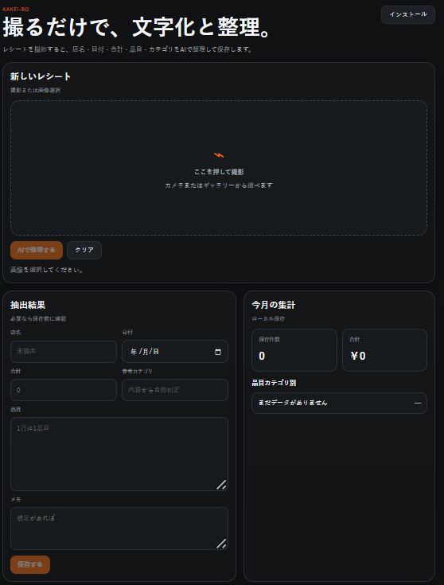

kakei-bo
撮るだけで、文字化と整理。

URL
https://kakei-bo.pages.dev/
概要
`kakei-bo` は、レシートを撮影して AI で整理し、保存・分類・集計まで行える家計簿アプリです。  
単なる OCR ではなく、品目の意味まで見てカテゴリ分けすることで、保存しただけで後から使えるデータにすることを狙っています。
主な機能
レシート撮影 / 画像選択
AI による文字化と整理
品目ごとのカテゴリ分類
`ソフトドリンク / お酒 / ノンアル / おかし` などの分類対応
カテゴリ修正の自動保存
辞書登録による分類精度の改善
ローカル保存
JSON 書き出し
パスワード入力による利用開始
使い方
アプリを開く
レシート画像を撮影、または選択する
AIで整理する を押す
内容を確認し、必要ならカテゴリを修正する
保存して履歴・集計を見る
必要に応じて JSON を書き出す
品目カテゴリについて
レシート全体をひとつのカテゴリに押し込むのではなく、品目ごとの中身で分類します。
例:
ブレンド → ソフトドリンク
ブラックサンダー → おかし
オールフリー → ノンアル
