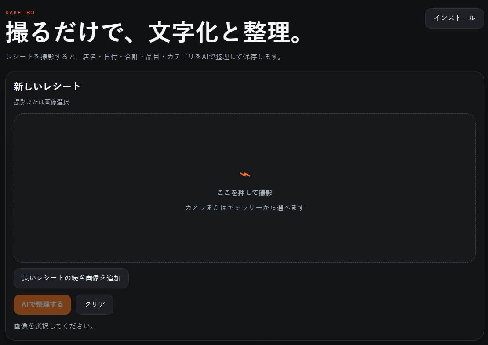
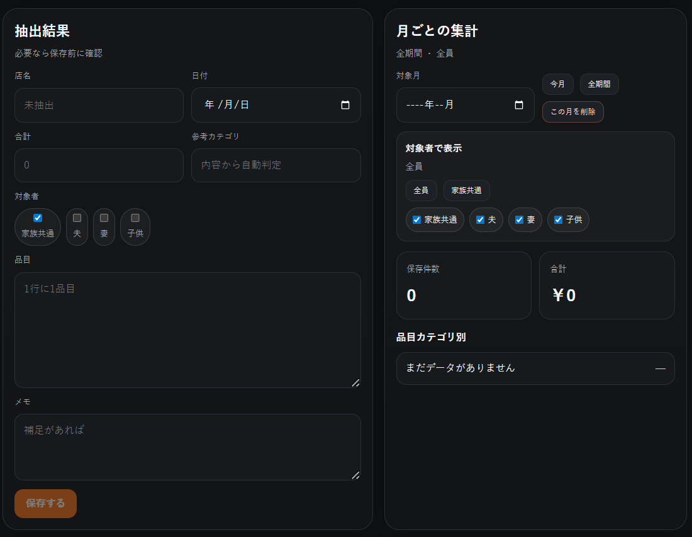
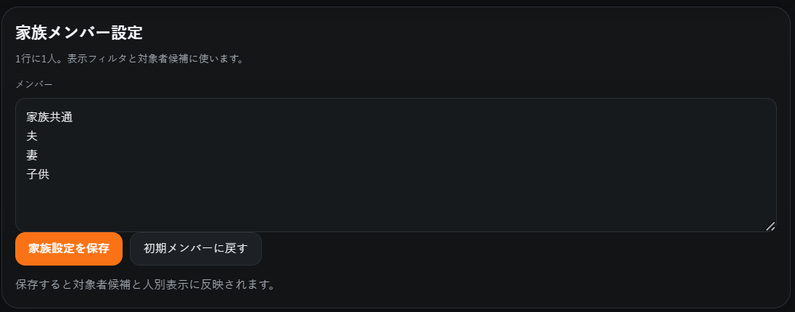
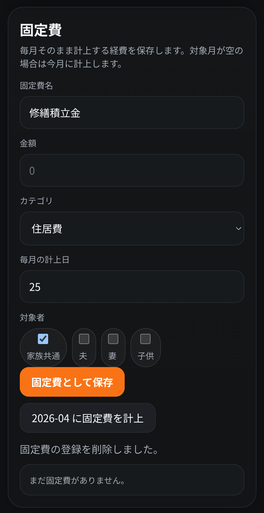

# kakei-bo

レシートを撮るだけで、文字化・分類・保存・集計までできる家計簿アプリです。

`kakei-bo` は、レシート画像を AI で整理し、店名・日付・合計・品目・カテゴリを抽出して保存できる PWA です。  
単に OCR で文字を読むだけでなく、**品目の意味**を見て分類することを重視しています。

さらに、**レシートがない買い物の直接入力**、**毎月の固定費管理**、**家族ごとの記録管理**、**JSON / CSV による持ち寄り運用**にも対応しています。

## 実行画面

- https://kakei-bo.pages.dev/

## Screenshots

### screenshot1

### screenshot2

### screenshot3

### screenshot4

### screenshot5（固定費機能）

## 主な機能

- レシート撮影 / 画像選択
- AI による文字化と意味ベースの整理
- 品目ごとのカテゴリ分類
- カテゴリ変更の即時反映
- ユーザー辞書登録
- レシートなしの直接入力
- 固定費テンプレートの保存
- 月ごとの固定費未計上チェック
- 固定費の手動確定計上
- 固定費の重複計上防止
- JSON 書き出し
- JSON 読み込み
- CSV 書き出し
- 月ごとの集計
- 月ごとの削除
- 値引き / クーポンのマイナス計上
- 独自カテゴリ対応
- 対象者ごとの記録管理（夫 / 妻 / 家族共通 / 子供 など）
- PWA 対応

## 特徴

### 1. OCRで終わらず、意味で整理する

たとえば、以下のような判定を行います。

- ブレンド → ソフトドリンク
- ブラックサンダー → おかし
- オールフリー → ノンアル
- 割引 / クーポン → マイナス計上

### 2. レシート全体ではなく、品目ベースで集計する

レシートごとに一つのカテゴリへ押し込むのではなく、**中身の品目ごと**に分類します。

例:

- ブレンド → ソフトドリンク
- ブラックサンダー → おかし
- オールフリー → ノンアル
- 食料品割引 → 値引き（マイナス）

### 3. レシートなしの支出も記録できる

自動販売機、現金払い、学校関係、ちょっとした立替など、レシートがない支出も直接入力できます。

日付、金額、内容、カテゴリ、対象者を入力して保存できます。

### 4. 毎月の固定費を管理できる

家賃、通信費、保険料、サブスクなど、毎月そのまま発生する支出を**固定費テンプレート**として保存できます。

固定費は、保存しただけでは支出履歴には入りません。  
対象月に対して未計上の場合だけ、アプリ上に未計上表示が出ます。

その上で、ユーザーが **「未計上固定費を計上」** ボタンを押したときだけ、その月の支出として保存されます。

これにより、

- 毎月同じ内容を入力し直さなくてよい
- でも勝手には記録されない
- 記録する前に確認できる
- 同じ月への重複計上を避けられる

という安全な運用ができます。

### 5. 使うほど自分用に育つ

AI の判定だけに頼らず、カテゴリ修正や辞書登録によって、アプリを自分向けに育てられます。

よく使う商品名やカテゴリの癖を、手元の運用に合わせて整えていけます。

### 6. 家族で使いやすい

対象者を分けて記録できるので、夫婦や家族で使うこともできます。

- 夫
- 妻
- 家族共通
- 子供

必要に応じて対象者を切り替えて、履歴や集計を見分けられます。

### 7. JSONを書き出すときは、現在の対象者フィルタに応じた latest 名で保存する

JSON 書き出しは、**現在表示している対象者に応じた記録だけ**を保存します。  
ファイル名も対象者ごとの latest 形式になります。

例:

- `kakei-bo-夫-latest.json`
- `kakei-bo-妻-latest.json`
- `kakei-bo-家族共通-latest.json`
- `kakei-bo-全員-latest.json`

これにより、家族それぞれの最新データを分けて管理しやすくしています。

## カテゴリ例

- 食費
- 日用品
- 外食
- 交通
- 医療
- 住居費
- 通信費
- 保険
- 教育
- サブスク
- ソフトドリンク
- お酒
- ノンアル
- おかし
- クーポン
- 値引き
- その他

※ カテゴリは独自設定にも対応しています。

## 使い方

### レシートありの場合

1. レシートを撮影、または画像を選択
2. **AIで整理する** を押す
3. 抽出結果を確認
4. 必要なら品目カテゴリを修正
5. 必要なら対象者を設定
6. 保存
7. 保存履歴、月ごとの集計、JSON / CSV 書き出しで活用

### レシートなしの場合

1. **レシートなしで記録** を選ぶ
2. 日付、金額、内容、カテゴリ、対象者などを直接入力
3. 保存

自動販売機、現金払い、学校関係など、レシートがない支出も記録できます。

### 固定費を登録する場合

1. 固定費名を入力
2. 金額を入力
3. カテゴリを選ぶ
4. 毎月の計上日を設定
5. 対象者を選ぶ
6. 固定費として保存

登録した固定費は、毎月の候補として残ります。

### 固定費を月ごとに計上する場合

1. 対象月を選ぶ
2. 未計上の固定費がある場合、未計上表示が出る
3. **未計上固定費を計上** を押す
4. その月の支出履歴として保存される
5. 月別集計、JSON、CSV に反映される

固定費は自動では記録されません。  
ユーザーが確認してボタンを押した時だけ、その月の支出として確定します。

## データ運用

### JSON 書き出し

JSON 書き出しは、現在の対象者フィルタに応じた記録だけを書き出します。

例:

- 夫を選択中 → 夫の記録だけを書き出し
- 妻を選択中 → 妻の記録だけを書き出し
- 家族共通を選択中 → 家族共通の記録だけを書き出し
- 全員を選択中 → 全員分を書き出し

### JSON 読み込み

書き出した JSON を読み込むことで、バックアップや家族間のデータ持ち寄りに使えます。

### CSV 書き出し

表計算ソフトや外部集計用に CSV として出力できます。

## 技術スタック

- OpenAI API
- Cloudflare Pages Functions
- PWA
- Vanilla JavaScript / HTML / CSS

## 補足

- 画像は端末内で扱われます。
- AI の判定結果は、レシートの状態や商品名の省略表記によって揺れることがあります。
- 辞書登録・カテゴリ修正により、継続利用で精度を上げられます。
- JSON 読み込みにより、バックアップや持ち寄り運用にも対応できます。
- JSON 書き出しは、現在の対象者フィルタに合う記録だけを保存します。
- 固定費はテンプレートとして保存され、対象月に計上した時点で通常の保存履歴に入ります。
- 固定費を削除する場合、すでに計上済みの履歴を残すか削除するかを確認できます。
- PWA で古い表示が残る場合は、ブラウザ更新や PWA の再インストールが必要になることがあります。

## License

Private / personal project
